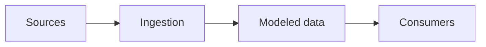

# Company — short title

* **Role:**
* **Period:**
* **Stack:**

## Context

Industry, team, and scale. No customer names, volumes, or internal system names that are not already public.

## Problem

## Constraints

## Options considered

What was on the table, and what made this path the one to take.

## Architecture

Sketch at pattern level: sources, orchestration, storage, consumers.

## What I owned

Separate your decisions from the team's.

## Outcome

One shareable result. Skip the number if you cannot say it in an interview with the door open.

## What I'd do differently
