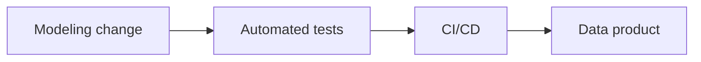

# ASAAS — Data governance and CI/CD

* **Role:** Analytics Engineer - Tech Lead (06/2026 – 09/2026)
* **Focus:** Data architecture, governance, CI/CD, mentorship
* **Stack:** _To write._

## Context

_To write: product, team, and what "reliable data product" meant there._

## Problem

Data products needed modeling standards, automated testing, and CI/CD so delivery stayed reliable end to end.

## Constraints

_To write._

## Options considered

_To write._

## Architecture

Sketch of the published overview: a modeling change passes through tests and CI/CD before it is a data product.

## What I owned

I defined data modeling, automated testing, and CI/CD pipelines for end-to-end data product reliability. I also led team enablement in software engineering principles and AI literacy.

## Outcome

_To write: one shareable result._

## What I'd do differently

_To write._
