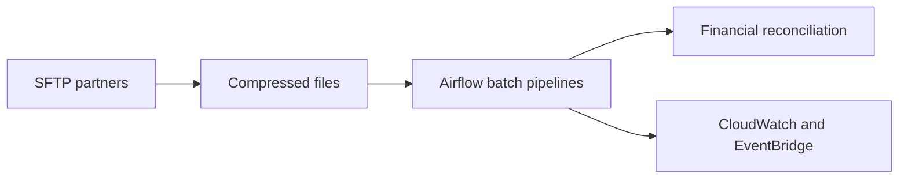

# Conta Simples — AWS financial reconciliation pipelines

* **Role:** Senior Data Engineer (05/2025 – 05/2026)
* **Stack:** `AWS` `Apache Airflow` `Python` `SQL` `SFTP` `Gzip`

## Context

_To write: what financial reconciliation needed from the platform, without partner names or file layouts._

## Problem

Batch pipelines had to ingest compressed files from secure SFTP partners and keep financial reconciliation restartable when a run failed.

## Constraints

_To write._

## Options considered

_To write._

## Architecture

Sketch of the published overview.

## What I owned

I designed the automated batch pipelines and reconciliation workflows, including ingestion of compressed partner files and monitoring with CloudWatch and EventBridge so runs could restart cleanly.

## Outcome

_To write: one shareable result._

## What I'd do differently

_To write._
