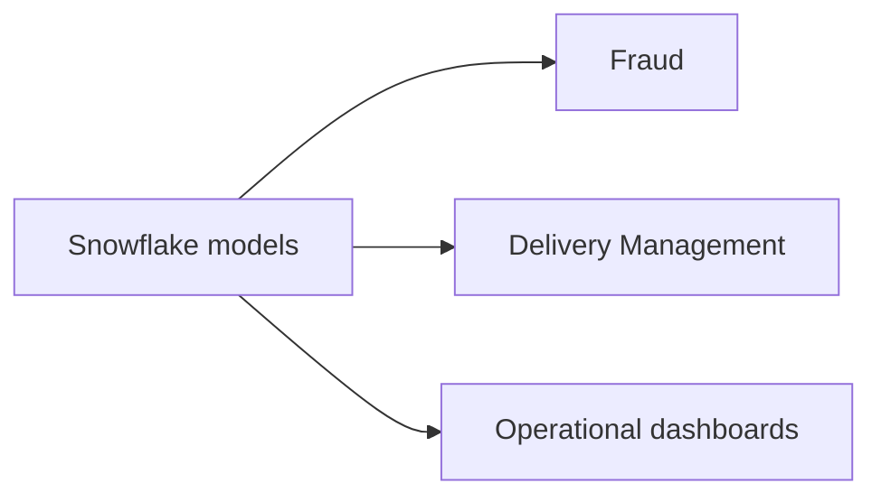

# Rappi — Snowflake BI and operations analytics

* **Role:** Data & Governance Analyst / BI Analyst (10/2020 – 01/2022)
* **Stack:** `Snowflake` `SQL` `Metabase` `Periscope` `Power BI`

## Context

Fraud and Delivery Management squads needed operational analytics on top of Snowflake.

## Problem

The squads needed analytical models, a curated communications dataset, and dashboards that operations could actually use.

## Constraints

_To write._

## Options considered

_To write._

## Architecture

Sketch of the published overview.

## What I owned

I built analytical SQL models in Snowflake for the Fraud and Delivery Management squads, curated communication databases, and structured the operational dashboards.

## Outcome

_To write: one shareable result._

## What I'd do differently

_To write._
