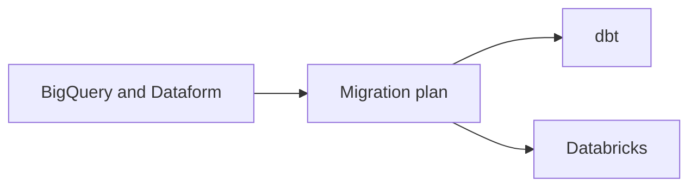

# Stone — Platform modernization with dbt and Databricks

* **Role:** Analytics Engineer - Tech Lead (01/2022 – 05/2025)
* **Stack:** `Apache Airflow` `SQL` `Dataform` `BigQuery` `dbt` `Databricks`

## Context

Customer service data products ran on BigQuery and Dataform. The platform direction was dbt and Databricks.

## Problem

The migration needed a technical plan: which datasets were in scope, how much refactoring they would take, and which modeling standards would replace the old ones.

## Constraints

_To write._

## Options considered

_To write._

## Architecture

Sketch of the direction I planned. This is the target platform, not a claim that every dataset had already moved.

## What I owned

I led the technical planning for the migration of customer service data products. I mapped the datasets, estimated refactoring effort, and set unified modeling standards.

## Outcome

_To write: one shareable result._

## What I'd do differently

_To write._
